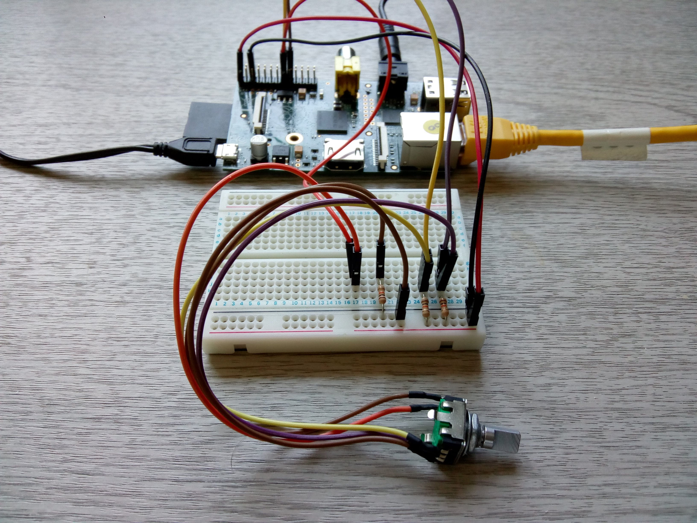
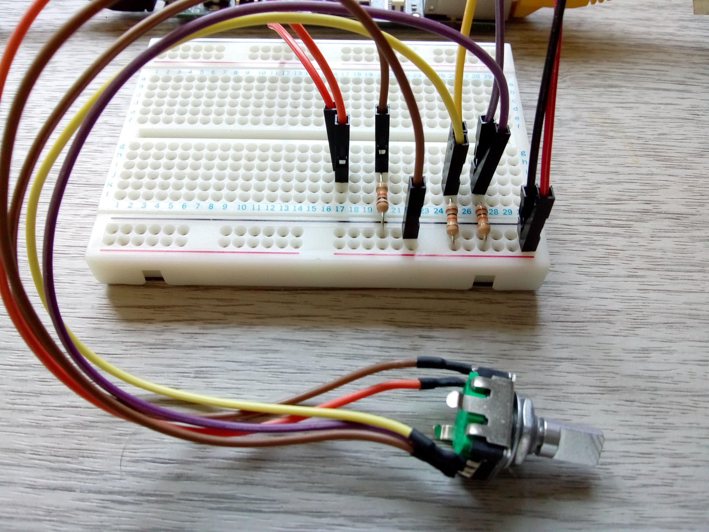
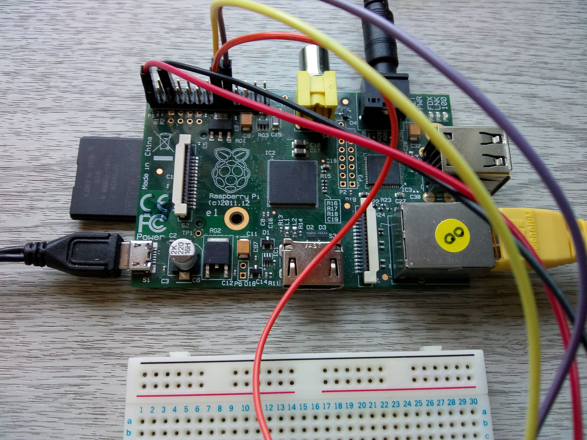

# radiopi
A streaming radio player for Raspberry Pi

radio.sh - runner for radiopi

radio.py - main application

streaming.py - VLC streaming module

stations.json - stations data

stations.orig.json - original stations file

clean-stations.sh - utility for cleaning bad entity codes from station names

## Installation
Enable the rotary-encoder and button (built-into encoder shaft) in Linux
kernel by by adding entries to the device tree in: 

/boot/config.txt

`#enable rotary encoder

dtoverlay=rotary-encoder,pin_a=23,pin_b=24,relative_axis=1`

`#enable button

dtoverlay=gpio-key,gpio=22,keycode=28,label="ENTER"`

### Radiopi System

### Rotary Encoder circuit

### Raspberry Pi Rev 2B connections

